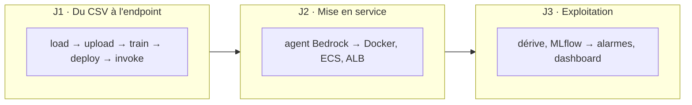

# aws-ds-starter

Dépôt de travail de la formation « AWS pour Data Scientists » — 3 jours, en binômes,
fil rouge contrôle qualité industriel.

**Vous écrivez le code qui manque.** Les signatures, les docstrings et les commentaires
sont là ; les corps de fonctions lèvent `NotImplementedError` avec un identifiant de
tâche. `TODO.md` en donne la liste.

## Démarrer

Sur votre machine de travail (le dépôt n'y est pas préinstallé — vous le clonez, c'est
instantané ; les paquets, eux, sont déjà en cache) :

```bash
git clone https://github.com/ssime-git/aws-ds-starter.git
cd aws-ds-starter
cp .env.example .env      # puis coller l'extrait .env fourni par le formateur
make sync                 # rapide : le cache uv de la machine est chaud
set -a; . ./.env; set +a  # requis devant les commandes Terraform
uv run qc                 # où en est le binôme
```

## Votre travail Git

Pendant le parcours normal, restez sur la branche `main`. À chaque checkpoint de fin de
journée, sauvegardez votre travail dans un commit **local** : aucun compte GitHub ni
`git push` n'est nécessaire.

```bash
git status
git add -A
git commit -m "Checkpoint J1 - modèle déployé"  # adapter J1, J2 ou J3
```

Avant tout changement de branche ou de tag, lancez `git status`. Ne passez pas au tag
d'une autre journée dans votre répertoire de travail habituel.

## Les tests sont l'énoncé

```bash
make test
```

Un échec nomme la tâche à faire :

```
NotImplementedError: TODO-D1-12
```

Cherchez cet identifiant dans le code, écrivez la fonction, relancez.

## Rattraper une journée

Les états de fin de journée sont posés en tags. Pour repartir d'une base saine sans
toucher à votre travail, créez un **nouveau clone** dans un autre dossier :

```bash
cd ~
git clone https://github.com/ssime-git/aws-ds-starter.git aws-ds-rattrapage-j2
cd aws-ds-rattrapage-j2
git switch -c jour-2 j1-fin        # ou j2-fin pour le J3
cp .env.example .env               # puis coller le même extrait .env du groupe
make sync
set -a; . ./.env; set +a
make check-day1
make restore-day1                  # seulement si le contrôle est rouge
```

Le tag remet le code au bon niveau ; `make restore-day1` ou `make restore-day2` sonde
l'état AWS réel et ne recrée que les ressources manquantes. Un nouveau clone ne crée ni
ne supprime aucune ressource AWS par lui-même.

## Les guides de journée

| | |
| --- | --- |
| [`docs/jour-1.md`](docs/jour-1.md) | du CSV à l'endpoint SageMaker |
| [`docs/jour-2.md`](docs/jour-2.md) | agent Bedrock, Docker, ECS, ALB |
| [`docs/jour-3.md`](docs/jour-3.md) | dérive, MLflow, alarmes, incidents |
| [`docs/01-decisions.md`](docs/01-decisions.md) | les arbitrages techniques, à lire en cas de doute |

---

## Les trois jours en un coup d'œil



Chaque étiquette est une commande réelle : `uv run qc load`, `uv run qc upload`, etc.
`uv run qc` sans argument affiche où en est le binôme.


---

## Arborescence

```
src/qc/                      l'application, que les apprenants font grandir (« qc » =
                             quality control, même préfixe que les ressources AWS)
app/main.py + Dockerfile     J2 · interface Streamlit et son image
tests/                       un fichier de tests par module (= énoncés dans le starter)
docs/                        briefs J1-J3, décisions
infra/terraform/
  bootstrap/                 bucket d'état — état local, appliqué une fois
  socle/                     ressources partagées, appliquées par le formateur
  team/                      appliqué par chaque binôme, état séparé
scripts/                     preflight, check_dayN, restore_dayN…
```

Pas de dossiers `day1/day2/day3` (D19) : les trois journées font grandir *une seule*
application ; l'ordre des étapes est porté par `uv run qc`.

## Trois règles qui expliquent la plupart des choix

1. **Aucun module de `qc` ne lit `os.environ`** — tout passe par `qc.config`, qui lit `.env`.
   Sur les machines binômes, `.env` ne contient **aucun credential** : le profil d'instance
   EC2 fournit les permissions.
2. **Tout le Python passe par `uv`** — même projet sur Arch, Ubuntu et Amazon Linux.
3. **Compte AWS partagé** : l'isolation repose sur le préfixe `qc-<TEAM_ID>`, les tags
   obligatoires, et les politiques IAM du profil d'instance `qc-<TEAM_ID>-workstation`
   (deny explicite hors préfixe). États Terraform séparés : socle d'un côté, une clé
   `team/<TEAM_ID>/` par binôme de l'autre.
